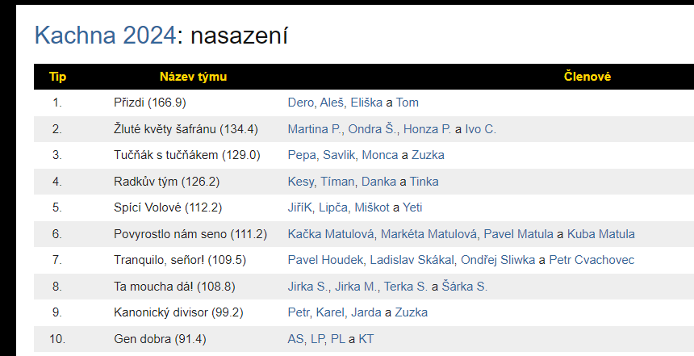
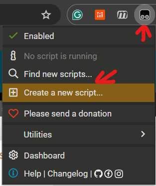

# Statek: Týmový KučaIndex

 

Pokud chcete takto vidět týmové KučaIndexy na stránce nasazení na [statku](https://statek.seslost.cz), Potřebujete:

1. Mít účet na [sifrovacky.cz](https://sifrovacky.cz), kterým se přihlásíte na Statek
2. Nainstalovat rozšíření [TamperMonkey](https://www.tampermonkey.net/) ve svém browseru
3. Přidat do TamperMonkey nový skript

 

a jeho obsah nahradit tímto:

```javascript

// ==UserScript==
// @name         Statek: Kuca Index per Team
// @namespace    http://tampermonkey.net/
// @version      2024-07-19
// @description  Sum of Kuca Index for the team members is shown alongside team name
// @author       Petr Valasek
// @match        https://statek.seslost.cz/*/nasazeni/*
// @icon         https://www.google.com/s2/favicons?sz=64&domain=seslost.cz
// @grant        none
// ==/UserScript==

(function() {
    console.log("Hi");
    const tableRows = document.querySelectorAll('tbody tr');
    tableRows.forEach(row => {
      const members = row.querySelector('.members').querySelectorAll('a');
      let total = 0.0;
      members.forEach(member => {
        const title = member.getAttribute('title');
        const match = title.match(/\((\d+\,\d+)\)/);
        if (match) {
          total += parseFloat(match[1].replace(',', '.'));
        }
      });
      row.querySelector('.team').textContent += " (" + total.toFixed(1) + ")";
    });
})();
```
